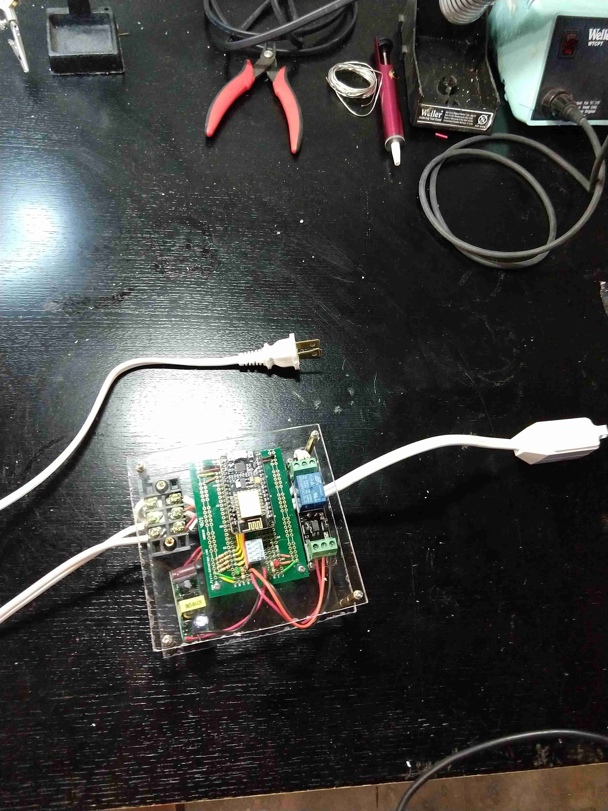
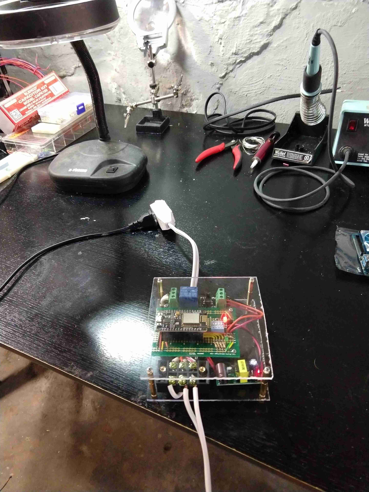
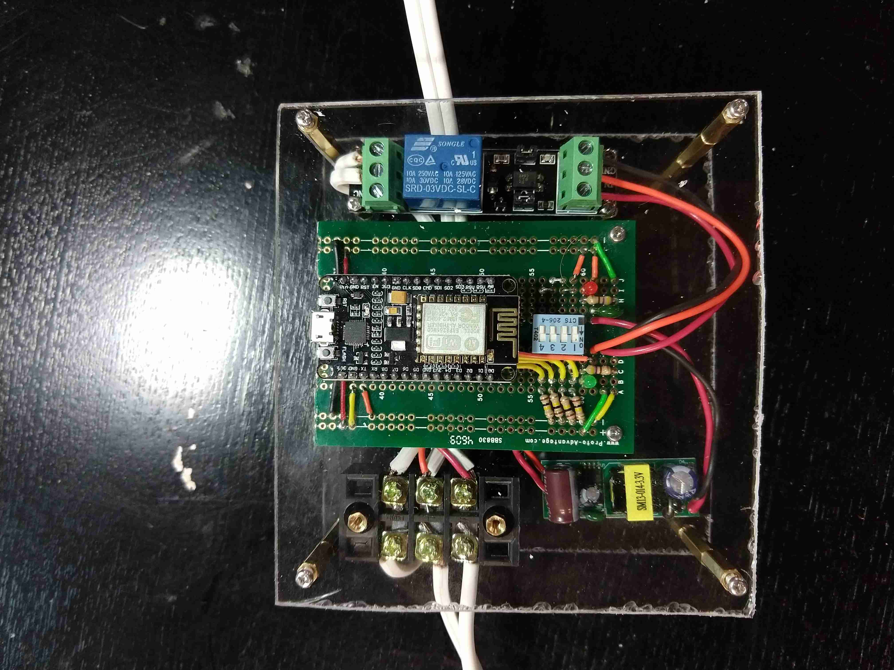

# wifi-power-cord

Fun little weekend project to make a wifi-controlled extension cord.

Runs on top of a esp8266 controller and talks to the world via mqtt.

### Contents  
- [Images](#images)  
- [Parts List](#parts-list)
- [Notes](#notes)

### Images

## Parts List

Components:
- [esp8266 NodeMCU dev board](https://www.amazon.com/gp/product/B010N1SPRK/ref=oh_aui_search_detailpage?ie=UTF8&psc=1)
- [3.3V switched relay](https://www.amazon.com/gp/product/B01M0E6SQM/ref=oh_aui_detailpage_o01_s00?ie=UTF8&psc=1)
- [3.3V power supply](https://www.amazon.com/gp/product/B00WMBRN14/ref=oh_aui_detailpage_o01_s02?ie=UTF8&psc=1)

Case:
- acryllic sheet
- standoffs

Extras
- extension cord
- 3 position screw terminal
- 4 position dip switch
- misc. resistors/capacitors/leds/protoboard

Server:
- system running an mqtt server. I'm using an odroid running mosquitto.

## Notes

- I threw a dip switch on the board which I am using to set the hostname for this unit on startup.  The controller reads a 4-bit value off of the switches and appends that number to its hostname and mqtt identifier.  This is nice because if you make a bunch of these things you don't have to worry about flashing a different id on each one.
- I put two LEDs on the main board, one that just lights up if the cord is plugged in and another that lights up when the relay is open.  They're certainly not necessary, and I might leave those off future builds in case I want to put one of these in a bedroom or someplace where LEDs could be bothersome in the dark.

